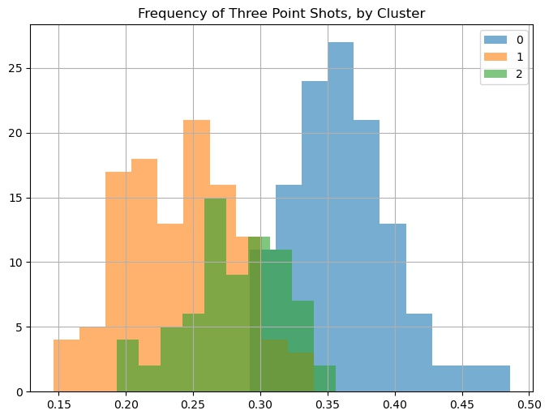
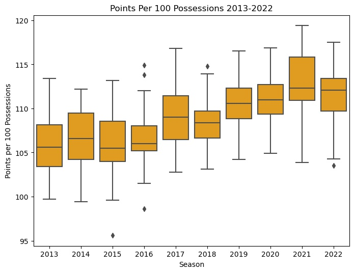

# Investigating Style Of Play In The NBA

The goal of this project is to tell the story of the last decade in the NBA, through the lens of style of play.  Using a clustering model, we can contexualize and group how  teams played over the last 10 seasons.  Data analytics has had a huge impact on the game, will this be apparent in our clusters?

# Executive Summary 
The data comes from `cleaningtheglass.com` in the form of various style of play statistics.  For the cluster model, I did not want to focus on performative statistics.  So how well a team shot, how many turnovers they averaged, things like this would influence the clusters beyond style of play.  To make sure the clusters were bourne out of stylistic differences rather than qualitative measures, I focused on the following statistics:  

* **Percent of plays in the Halfcourt**.  Out of all of a team's posessions, what percentage were played "in halfcourt" as opposed to in transition.

* **Offensive Rebound Percent**.  The percent of a teams total shots that turned into an offensive rebound.  This statistic only tracks shots that occur during a halfcourt possession.

* **Frequency of Transition**.  The percent of a team's possessions that occurred in transition.

* **Frequency of Shots at the Rim**.  The percent of a team's shots that occurred at the rim.

* **Frequency of Shots from Short Mid-Range**.  The percent of a team's shots that occurred from short mid-range.

* **Frequency of Shots from Long Mid-Range**.  The percent of a team's shots that occurred from long mid-range, or the dreaded long-two.  

* **Frequency of Shots from Mid-Range**. The percent of a team's shots that occurred from mid-range.

* **Frequency of Corner Threes**. The percent of a team's shots that were corner three pointers.

* **Frequency of Non-Corner Threes**. The percent of a team's shots that were non-corner three pointers.

* **Frequency of All Threes**. The percent of a team's shots that were three pointers.

I compiled a dataframe for these statistics, for each team over the last 10 seasons.  I fed this data into a KMeans Clusters model and plotted a range of inertia scores.  The 'elbow' on this polot occurred around 3, therefore `n_clusters` was to set to 3.    

### Makeup of Clusters

This table differences between the clusters in regards to key style of play statistics (note that the numbers in the table are the mean for each stat):

| Stat      | Cluster 0 | Cluster 1 | Cluster 2
| ----------- | ----------- |-----------|----------|
| Year   | 2020 | 2015 | 2017|
| Frequency of All Threes  | 36.0 % | 23.9 % | 28.0 % |
| Frequency of Mid-Range Shots | 29.8 % | 41.6 % | 34.0 % |
| Offensive Rebound Percent | 25.7 % | 27.6 % | 28.1 % |
| Frequency of Transition | 14.7 % | 13.0 % | 16.6 % |

There is a clear division in the `year` makeup of the clusters.  Cluster 0 has an average `year` of 2020, and represents the newer-age style of play, or the style most informed by analytics.  Teams from that cluster shoot by far the most three pointers and the least amount of mid-range shots.  On the other hand, Cluster 1 is the opposite.  Teams from that cluster shoot the least amount of threes, and most mid-range shots.  The `year` average in Cluster 1 is 2015.  

Everything begins and ends with the rise in popularity of the three-pointer.  As the importance of data analytics has risen in most front offices around the league, teams are embracing the "3 is more than 2" mantra.  In just 5 years (the difference in average `year` between Cluster 0 and Cluster 1), three-point frequency went up from ~24% to 36% for a 50% increase.  That is a massive overhaul in style of play!  The visual below showcases the shift in three-point frequency in our clusters:

The effects of the three-point boom can be seen in other, non three-point shooting, statistics.  For example, teams are punting more often on going for offensive rebounds.  Cluster 1 teams rebounded 27.6% of their own shots, whereas Cluster 0 teams only rebounded 2% less of their shots.  Why?  Going for offensive rebounds leaves your defense vulnerable to transition.  This has always been the case, but what's changed is what teams are looking to do in transition.  Instead of trying for a layup or a foul, they're hunting wide-open three point shots (efficiency!).  So our data-driven teams in Cluster 0 are deciding more often that they'd rather forego an offensive rebound in the hopes to guard against these open three-point looks.

### Efficiency, efficiency, efficiency! Is this the only way?  When does it end?
Overall, data-analytics has pushed the league to get more efficient on the offensive end.  Ten years ago the average points-per-100-possessions was 106.  That number has risen to 112 over the last decade.  

